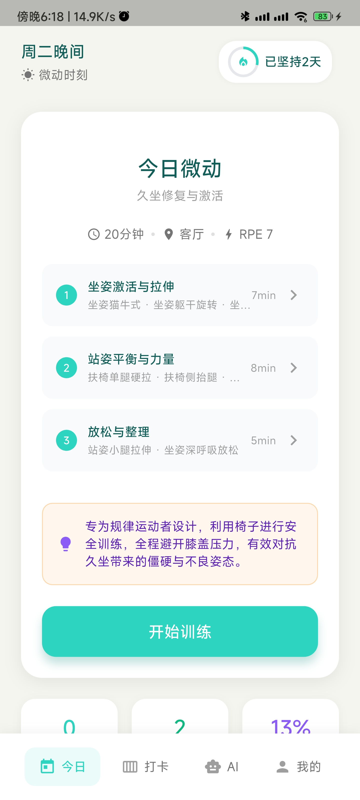
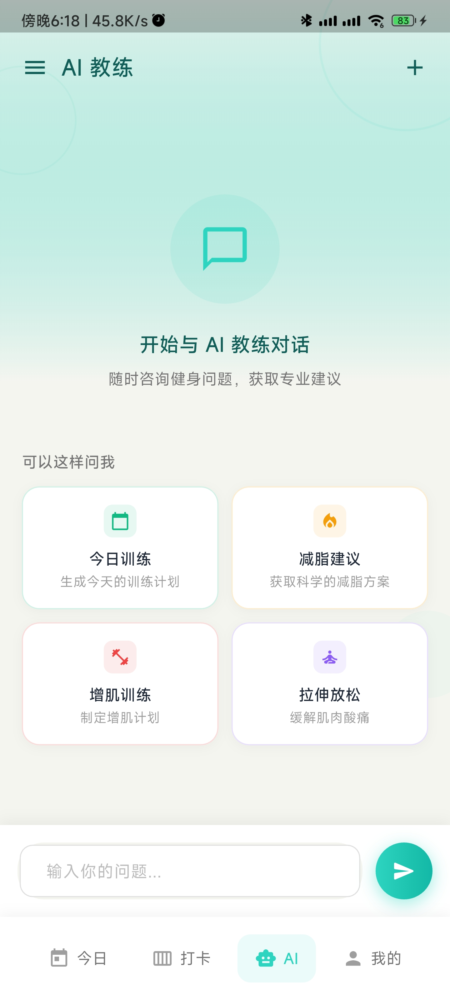
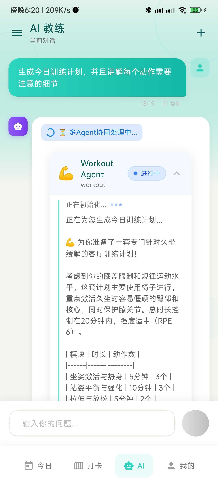
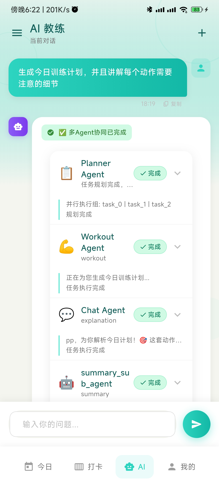
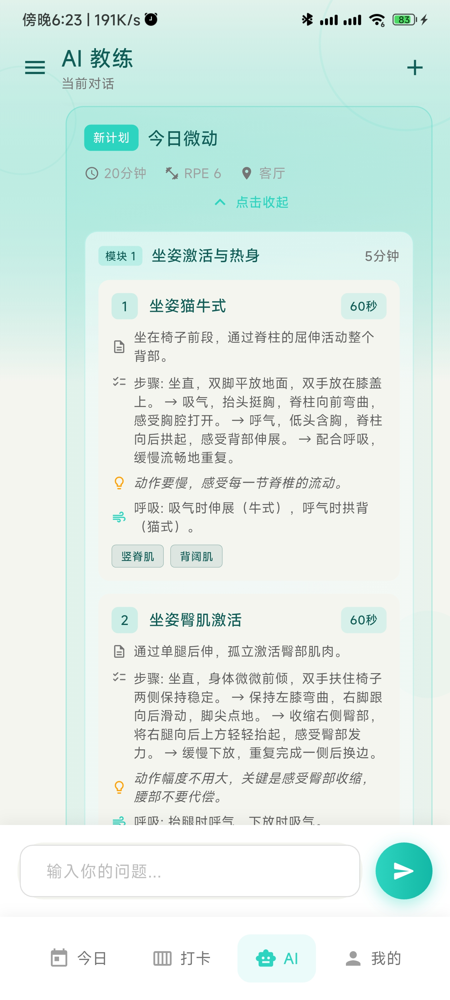

# 微动 MicoFit 🏋️

> 你的 AI 随身健身教练，利用碎片时间（3-20分钟）在任意场景完成有效训练。

[](https://flutter.dev)
[](https://fastapi.tiangolo.com)
[](https://langchain-ai.github.io/langgraph/)
[](LICENSE)

---

## 📸 应用截图

<div align="center">
  <table>
    <tr>
      <td align="center"><b>今日计划</b></td>
      <td align="center"><b>AI 教练</b></td>
      <td align="center"><b>计划生成中</b></td>
    </tr>
    <tr>
      <td></td>
      <td></td>
      <td></td>
    </tr>
    <tr>
      <td align="center"><b>多 Agent 协作</b></td>
      <td align="center"><b>训练计划UI</b></td>
      <td></td>
    </tr>
    <tr>
      <td></td>
      <td></td>
      <td></td>
    </tr>
  </table>
</div>

---

## 📱 项目概述

**微动 MicoFit** 是一个基于 Flutter + FastAPI 的全栈健身应用，专为忙碌人群设计。应用核心理念是**打破传统健身的时间与空间限制**，让用户可以在办公室、家中、户外等任意场景，利用碎片时间完成科学有效的训练。

### 核心场景

- 🏢 **办公室** - 工位旁的微运动，缓解久坐疲劳
- 🏠 **居家** - 客厅、卧室随时开练
- 🌳 **户外** - 公园、旅行途中保持运动习惯
- 🛏️ **床上/酒店** - 低强度恢复性训练

### 目标用户

- 工作繁忙、难以抽出大块时间健身的上班族
- 健身新手，需要科学指导和专业计划
- 希望养成运动习惯但缺乏自律的人群
- 经常出差、需要灵活训练方案的商务人士

---

## 🏗️ 技术架构

### 整体架构

```
┌─────────────────────────────────────────────────────────────────────────┐
│                         微动 MicoFit 架构图                               │
├─────────────────────────────────────────────────────────────────────────┤
│                                                                         │
│  ┌─────────────────────────────┐        ┌─────────────────────────────┐ │
│  │      Flutter Frontend       │        │      FastAPI Backend        │ │
│  │  ┌─────────────────────┐    │◄──────►│  ┌─────────────────────┐    │ │
│  │  │     Pages (UI)      │    │  HTTP  │  │   API Endpoints     │    │ │
│  │  │  • Today Plan       │    │        │  │  • /auth            │    │ │
│  │  │  • AI Chat          │    │        │  │  • /workouts        │    │ │
│  │  │  • Exercise Detail  │    │        │  │  • /ai/chat         │    │ │
│  │  │  • Weekly Stats     │    │        │  │  • /sync            │    │ │
│  │  └─────────────────────┘    │        │  └─────────────────────┘    │ │
│  │           ↓                 │        │           ↓                 │ │
│  │  ┌─────────────────────┐    │        │  ┌─────────────────────┐    │ │
│  │  │    Providers        │    │        │  │     Services        │    │ │
│  │  │  (State Management) │    │        │  │  • Auth Service     │    │ │
│  │  └─────────────────────┘    │        │  │  • Workout Service  │    │ │
│  │           ↓                 │        │  │  • AI Service       │    │ │
│  │  ┌─────────────────────┐    │        │  └─────────────────────┘    │ │
│  │  │      Services       │    │        │           ↓                 │ │
│  │  │  • HTTP Client      │    │        │  ┌─────────────────────┐    │ │
│  │  │  • Sync Manager     │    │        │  │      Agents         │    │ │
│  │  │  • Local Storage    │    │        │  │  • RouterAgent      │    │ │
│  │  └─────────────────────┘    │        │  │  • PlannerAgent     │    │ │
│  │           ↓                 │        │  │  • SubAgents        │    │ │
│  │  ┌─────────────────────┐    │        │  └─────────────────────┘    │ │
│  │  │   Offline Queue     │    │        │           ↓                 │ │
│  │  │  (Local SQLite)     │    │        │  ┌─────────────────────┐    │ │
│  │  └─────────────────────┘    │        │  │   LLM Provider      │    │ │
│  │                             │        │  │  (OpenAI/Claude)    │    │ │
│  └─────────────────────────────┘        │  └─────────────────────┘    │ │
│                                         └─────────────────────────────┘ │
│                                                                         │
└─────────────────────────────────────────────────────────────────────────┘
```

### 前端技术栈 (Flutter)

| 技术 | 用途 | 版本 |
|------|------|------|
| **Flutter** | 跨平台 UI 框架 | ^3.10.7 |
| **Provider** | 状态管理 | ^6.1.1 |
| **flutter_secure_storage** | 安全本地存储 | ^9.2.2 |
| **connectivity_plus** | 网络状态检测 | ^6.0.0 |
| **fl_chart** | 数据可视化图表 | ^0.68.0 |
| **flutter_markdown** | Markdown 渲染 | ^0.7.4+3 |
| **share_plus** | 社交分享功能 | ^7.2.0 |

### 后端技术栈 (FastAPI)

| 技术 | 用途 | 版本 |
|------|------|------|
| **FastAPI** | Web API 框架 | 0.115.0 |
| **SQLAlchemy** | ORM 数据库操作 | 2.0.35 |
| **Alembic** | 数据库迁移 | 1.14.0 |
| **Pydantic** | 数据验证 | 2.10.1 |
| **LangChain** | LLM 应用框架 | latest |
| **LangGraph** | Agent 工作流编排 | latest |

### 数据库设计

```
┌────────────────┐     ┌──────────────────┐     ┌──────────────────┐
│     users      │     │   workout_plans  │     │  workout_records │
├────────────────┤     ├──────────────────┤     ├──────────────────┤
│ id (PK)        │◄────┤ user_id (FK)     │     │ user_id (FK)     │
│ username       │     │ plan_date        │     │ plan_id (FK)     │
│ email          │     │ title            │     │ record_date      │
│ hashed_password│     │ total_duration   │     │ completion       │
│ created_at     │     │ scene            │     │ feeling          │
└────────────────┘     │ modules (JSON)   │     │ pain_locations   │
                       │ is_completed     │     └──────────────────┘
                       └──────────────────┘

┌──────────────────┐     ┌──────────────────┐
│  chat_sessions   │     │ chat_messages    │
├──────────────────┤     ├──────────────────┤
│ id (PK)          │◄────┤ session_id (FK)  │
│ user_id (FK)     │     │ role             │
│ title            │     │ content          │
│ context_summary  │     │ agent_outputs    │
│ last_active      │     │ created_at       │
└──────────────────┘     └──────────────────┘
```

---

## 🤖 Planner 多智能体架构

### 架构演进

MicoFit 的 AI 架构经历了三个阶段的演进：

```
阶段 1: 单体 Agent        阶段 2: Router 架构        阶段 3: Planner 架构 (当前)
┌──────────────┐         ┌──────────────┐          ┌──────────────────────┐
│   ChatAgent  │         │ RouterAgent  │          │    PlannerAgent      │
│              │         │  (意图识别)   │          │   (任务编排中心)      │
│  ┌────────┐  │         └──────┬───────┘          └──────────┬───────────┘
│  │  LLM   │  │                │                             │
│  └────────┘  │         ┌──────┴──────┐           ┌──────────┴──────────┐
└──────────────┘         │             │           │                     │
                   ┌─────┴────┐   ┌────┴────┐  ┌───┴───┐  ┌────┐    ┌────┴────┐
                   │ChatSub   │   │Workout  │  │ Task  │  │Task│    │ Summary │
                   │ Agent    │   │SubAgent │  │Analyze│  │Plan│    │SubAgent │
                   └──────────┘   └─────────┘  └───┬───┘  └────┘    └─────────┘
                                                   │
                                             ┌─────┴────┐
                                             │  Task    │
                                             │ Executor │
                                             └──────────┘
```

### 当前架构详解

#### 1. RouterAgent - 智能路由网关

负责接收所有用户消息，进行**意图识别**和**智能分发**：

```python
# 工作流程
intent_recognition → route_decision → [chat_sub_agent | workout_sub_agent] → finalize
```

**核心能力**：
- 使用 LLM 进行多维度意图识别（置信度评分）
- 实体提取（部位、场景、时长、强度）
- 自动路由到对应 SubAgent

#### 2. PlannerAgent - 任务规划调度中心

处理**复杂多步骤任务**，实现真正的多 Agent 协作。核心设计理念是将复杂用户请求拆分为可独立执行的子任务，通过依赖编排和并行执行提高效率。

##### 核心组件架构

```
┌─────────────────────────────────────────────────────────────────┐
│                      PlannerAgent 组件架构                       │
├─────────────────────────────────────────────────────────────────┤
│                                                                 │
│  ┌──────────────┐    ┌──────────────┐    ┌──────────────┐       │
│  │ TaskAnalyzer │───►│  TaskPlanner │───►│ TaskExecutor │       │
│  │   (分析)      │    │   (规划)      │    │   (执行)    │       │
│  └──────────────┘    └──────────────┘    └──────────────┘       │
│         │                   │                   │               │
│         ▼                   ▼                   ▼               │
│  ┌──────────────────────────────────────────────────────┐       │
│  │                   SharedContextPool                  │       │
│  │              (跨任务数据共享与事件通知)                │       │
│  └──────────────────────────────────────────────────────┘       │
│                              │                                  │
│                              ▼                                  │
│  ┌──────────────────────────────────────────────────────┐       │
│  │                 ResultAggregator                     │       │
│  │                (策略模式结果聚合)                      │      │
│  └──────────────────────────────────────────────────────┘       │
│                                                                 │
└─────────────────────────────────────────────────────────────────┘
```

##### 关键技术设计

**1. 多意图识别与任务拆分**

TaskAnalyzer 通过 LLM 分析用户输入，识别潜在的多个意图并拆分为子任务：

| 用户输入示例 | 识别意图 | 拆分任务 |
|-------------|---------|---------|
| "生成核心训练计划" | ["workout"] | task_0: 生成训练计划 |
| "生成计划并解释动作要领" | ["workout", "explanation"] | task_0: 生成计划 → task_1: 解释动作 |
| "今天好累，随便练一下再聊聊饮食" | ["workout", "chat"] | task_0: 生成低强度计划 + task_1: 饮食建议（并行） |

- **复杂度判定**：单意图为 simple，多意图根据类型组合判定为 medium 或 complex
- **降级策略**：LLM 调用失败时，基于关键词规则进行意图识别

**2. 拓扑排序与依赖管理**

TaskPlanner 使用 **Kahn 算法**（时间复杂度 O(V+E)）进行拓扑排序，确保任务按正确依赖顺序执行：

```
输入: tasks = [
    {id: "task_0", depends_on: []},
    {id: "task_1", depends_on: ["task_0"]},
    {id: "task_2", depends_on: []},
    {id: "task_3", depends_on: ["task_1", "task_2"]}
]

拓扑排序结果: ["task_0", "task_2", "task_1", "task_3"]

并行组识别:
- Batch 0: ["task_0", "task_2"]  (无依赖，可并行)
- Batch 1: ["task_1"]           (依赖 task_0)
- Batch 2: ["task_3"]           (依赖 task_1 和 task_2)
```

**3. 并行执行与流式输出**

TaskExecutor 支持两种执行模式：

| 模式 | 适用场景 | 技术实现 |
|------|---------|---------|
| **串行模式** | 简单任务、调试场景 | 按 execution_order 顺序执行 |
| **并行模式** | 多任务、复杂场景 | `asyncio.Queue` 多路复用 + `asyncio.Event` 同步 |

并行执行核心机制：
- **多路复用**：使用 `asyncio.Queue` 收集多个并行任务的输出
- **事件通知**：`asyncio.Event` 实现任务完成通知，避免轮询
- **超时控制**：每个任务设置 30 秒超时，防止死锁
- **实时流式**：通过 `AsyncGenerator` 实时向客户端推送各任务的输出 chunk

**4. 跨任务数据共享**

SharedContextPool 提供线程安全的数据共享机制：

- **数据存储**：基于字典的 Key-Value 存储
- **事件驱动**：数据写入时自动触发 `asyncio.Event`，通知等待者
- **任务结果缓存**：`set_task_result` / `wait_task_complete` 支持任务间结果传递
- **生命周期管理**：请求结束时统一清理，避免内存泄漏

**5. 策略模式结果聚合**

ResultAggregator 根据任务类型组合选择不同的聚合策略：

```
任务组合 → 聚合策略

workout + explanation → 解释内容前置，计划详情后置（分隔线分割）
workout + chat        → 闲聊回复前置，训练计划后置
multiple workouts     → SummarySubAgent 生成对比分析
single chat           → 直接返回对话内容
```

#### 3. SubAgents - 专业功能代理

| SubAgent | 职责 | 工作流 |
|----------|------|--------|
| **ChatSubAgent** | 日常对话、健身咨询 | 单轮/多轮对话 |
| **WorkoutSubAgent** | 训练计划生成 | 4节点工作流：build_prompt → generate → parse → validate |
| **SummarySubAgent** | 多任务结果总结 | 智能聚合、Markdown格式化 |

#### 4. LangGraph 工作流示例

```python
# WorkoutSubAgent 工作流定义
workflow = StateGraph(WorkoutSubAgentState)

# 添加节点
workflow.add_node("build_prompt", build_prompt_node)
workflow.add_node("generate", generate_node)
workflow.add_node("parse", parse_node)
workflow.add_node("validate", validate_node)
workflow.add_node("retry", retry_node)  # 错误重试

# 定义边
workflow.set_entry_point("build_prompt")
workflow.add_edge("build_prompt", "generate")
workflow.add_edge("generate", "parse")
workflow.add_edge("parse", "validate")

# 条件边：验证失败时重试
workflow.add_conditional_edges(
    "validate",
    should_retry,
    {"end": END, "retry": "retry"}
)
workflow.add_edge("retry", "generate")
```

### 智能特性

1. **自纠错机制** - 计划生成失败时自动修正并重试（最多3次）
2. **并行执行** - 独立任务同时执行，降低总延迟
3. **依赖管理** - 通过拓扑排序确保任务按正确顺序执行
4. **流式输出** - 实时向客户端推送生成进度

### 完整流程示例

以用户输入 *"给我生成一个核心训练计划，顺便解释一下每个动作的要领"* 为例：

```
┌─────────────────────────────────────────────────────────────────────────┐
│                           完整执行流程                                   │
├─────────────────────────────────────────────────────────────────────────┤
│                                                                         │
│  1. TaskAnalyzer 分析                                                   │
│     └─► LLM 识别出 intents: ["workout", "explanation"]                   │
│     └─► 提取 entities: {focus_body_part: "core"}                         │
│     └─► 判定 complexity: "complex"（需要规划）                            │
│     └─► 生成 sub_tasks:                                                  │
│         ├─ task_0: {type: "workout", depends_on: []}                     │
│         └─ task_1: {type: "explanation", depends_on: ["task_0"]}         │
│                                                                         │
│  2. TaskPlanner 规划                                                     │
│     └─► 拓扑排序: ["task_0", "task_1"]                                    │
│     └─► 并行组: [["task_0"], ["task_1"]] （task_1 依赖 task_0）           │
│     └─► 添加 summary_task（依赖 task_0 和 task_1）                        │
│                                                                         │
│  3. TaskExecutor 执行                                                    │
│     └─► 批次 0: 执行 task_0 (workout_sub_agent)                          │
│         ├─ 生成训练计划                                                   │
│         └─ 写入 context.set_workout_plan(plan)                          │
│                                                                         │
│     └─► 批次 1: 执行 task_1 (chat_sub_agent)                             │
│         ├─ 从 context 获取 plan                                          │
│         ├─ 解释每个动作要领                                               │
│         └─ 写入 context.set_task_result("task_1", result)               │
│                                                                         │
│     └─► 批次 2: 执行 task_2 (summary_sub_agent)                          │
│         ├─ 收集 task_0 和 task_1 的输出                                  │
│         └─ 生成整合回复                                                   │
│                                                                         │
│  4. ResultAggregator 聚合                                                │
│     └─► 检测到 workout + explanation 组合                                │
│     └─► 使用 _aggregate_workout_with_explanation 策略                    │
│     └─► 输出: {type: "workout_with_explanation", content: "..."}         │
│                                                                         │
└─────────────────────────────────────────────────────────────────────────┘
```

---

## ✨ 项目亮点

### 1. 智能离线同步机制

```dart
// 轮询式同步架构
SyncManager (轮询协调器)
    ├── NetworkService (网络状态检测)
    ├── OfflineQueueService (离线队列)
    ├── DataSyncService (数据同步)
    └── SyncAPIService (后端接口)

// 核心特性
- 自动检测网络恢复并触发同步
- 冲突检测与解决策略
- 增量同步优化流量
- 支持离线模式完全可用
```

**实现细节**：
- 使用 `Timer.periodic` 实现轮询检测（3秒间隔检查队列，5分钟定期同步）
- 队列持久化到 SQLite，确保数据不丢失
- 网络状态变化时自动触发同步

### 2. AI 驱动的个性化训练

```
用户画像 → 意图识别 → 计划生成 → 动态调整
    │           │           │           │
    ▼           ▼           ▼           ▼
- 健身水平   - 自然语言   - JSON结构   - 训练反馈
- 可用场景   - 实体提取   - 模块化设计  - RPE调整
- 时间预算   - 多意图识别  - 自动验证   - 次日适配
```

**个性化维度**：
- 健身目标（减脂/增肌/保持健康）
- 训练场景（办公室/居家/户外/酒店）
- 身体限制（腰/膝/肩等部位）
- 可用装备（徒手/弹力带/哑铃）
- 时间预算（5-60分钟可调）

### 3. 精致的 Flutter UI 设计

**设计系统**：
- 主色调：薄荷绿 `#2DD4BF`（代表活力与健康）
- 辅助色：AI紫 `#8B5CF6`、温暖米色 `#F5F5F0`
- 圆角规范：卡片 12-24px，按钮 12-16px
- 动画：流畅的页面切换（300ms淡入淡出+滑动）

**核心组件**：
- `WorkoutCard` - 训练计划卡片（玻璃拟态效果）
- `BottomNav` - 底部导航栏（自定义动画）
- `OfflineIndicator` - 离线状态指示器
- `AgentAccordion` - AI输出折叠面板

### 4. 完善的用户数据隔离

```dart
// 用户数据隔离机制
UserDataHelper
    ├── setCurrentUserId(userId)    // 切换用户时调用
    ├── clearCurrentUserId()         // 登出时调用
    └── getCurrentUserId()           // 获取当前用户

// Provider 级别隔离
- ChatProvider: 按 userId 加载历史消息
- WorkoutProvider: 按 userId 加载训练计划
- WorkoutProgressProvider: 按 userId 保存进度
```

### 5. 流式 AI 响应体验

```dart
// 流式处理架构
AIApiService.streamChat()
    ├── 发送 SSE 请求
    ├── 实时解析 chunks
    ├── 识别特殊事件（intent/plan/done）
    └── 通过 Provider 更新 UI

// ChatProvider 状态管理
- isStreaming: 控制加载动画
- messages: 实时追加内容
- autoScroll: 流式期间自动滚动
```

---

## 📂 项目结构

```
micofit/
├── lib/                          # Flutter 前端代码
│   ├── main.dart                 # 应用入口
│   ├── config/
│   │   └── app_config.dart       # 环境配置
│   ├── models/                   # 数据模型层
│   │   ├── exercise.dart         # 动作模型
│   │   ├── workout.dart          # 训练计划模型
│   │   ├── user_profile.dart     # 用户画像模型
│   │   └── chat_message.dart     # 聊天消息模型
│   ├── pages/                    # 页面层
│   │   ├── today_plan_page.dart  # 今日计划
│   │   ├── ai_chat_page.dart     # AI 聊天
│   │   ├── exercise_detail_page.dart # 动作详情
│   │   └── ...
│   ├── providers/                # 状态管理（Provider）
│   │   ├── auth_provider.dart
│   │   ├── workout_provider.dart
│   │   ├── chat_provider.dart
│   │   └── sync_provider.dart
│   ├── services/                 # 服务层
│   │   ├── sync_manager.dart     # 同步管理器
│   │   ├── ai_api_service.dart   # AI 服务
│   │   └── offline_queue_service.dart
│   ├── widgets/                  # 可复用组件
│   └── utils/                    # 工具函数
│
├── backend/                      # FastAPI 后端代码
│   ├── main.py                   # 应用入口
│   ├── app/
│   │   ├── api/v1/               # API 路由
│   │   │   ├── auth.py
│   │   │   ├── ai.py             # AI 相关接口
│   │   │   └── workouts.py
│   │   ├── agents/               # AI Agent 核心
│   │   │   ├── router_agent.py   # 路由 Agent
│   │   │   ├── planner_agent.py  # 规划 Agent
│   │   │   ├── workout_sub_agent.py
│   │   │   ├── chat_sub_agent.py
│   │   │   ├── task_analyzer.py
│   │   │   ├── task_planner.py
│   │   │   └── task_executor.py
│   │   ├── models/               # 数据库模型（SQLModel）
│   │   ├── services/             # 业务逻辑层
│   │   └── core/                 # 核心配置
│   └── alembic/                  # 数据库迁移
│
├── assets/                       # 静态资源
│   ├── exercises/                # 动作示意图
│   └── icon/                     # 应用图标
│
└── test/                         # 测试代码
```

---

## 🚀 快速开始

### 环境要求

- **Flutter**: >= 3.10.7
- **Dart**: >= 3.0.0
- **Python**: >= 3.10
- **MySQL**: >= 8.0 (或 SQLite 用于开发)

### 前端启动

```bash
# 1. 安装依赖
flutter pub get

# 2. 运行应用
flutter run

# 3. 构建 release 版本
flutter build apk              # Android
flutter build ios              # iOS (需 macOS)
flutter build web              # Web
```

### 后端启动

```bash
# 1. 进入后端目录
cd backend

# 2. 创建虚拟环境
conda create -n micofit python=3.12
conda activate micofit

# 3. 安装依赖
pip install -r requirements.txt

# 4. 配置环境变量
cp .env.example .env
# 编辑 .env 文件，设置数据库和 OpenAI API Key

# 5. 启动服务
uvicorn main:app --reload --host 0.0.0.0 --port 8000
```

### 环境变量配置

```env
# 后端 .env
APP_NAME="微动 MicoFit"
DEBUG=true

# 数据库
DB_HOST=localhost
DB_PORT=3306
DB_USER=root
DB_PASSWORD=your_password
DB_NAME=micofit

# OpenAI
OPENAI_API_KEY=sk-...
OPENAI_MODEL=gpt-4o-mini
OPENAI_BASE_URL=https://api.openai.com/v1  # 可选，用于代理

# JWT
SECRET_KEY=your-secret-key
ACCESS_TOKEN_EXPIRE_MINUTES=10080
```

---

## 🎯 主要功能

### 1. 今日计划

- AI 根据用户画像生成每日个性化训练计划
- 支持多模块结构（热身 → 主训练 → 拉伸）
- 训练进度实时保存，支持中断续练

### 2. AI 聊天教练

- 自然语言对话获取健身建议
- 支持生成/修改训练计划
- 多轮对话上下文保持
- 会话历史自动摘要

### 3. 动作指导

- 详细动作步骤说明
- 呼吸技巧提示
- 常见错误纠正
- 计时器功能

### 4. 训练反馈

- 完成度评分（太难/刚好/太简单）
- 身体感受记录
- 疼痛部位标记
- 明日训练偏好

### 5. 周历统计

- 月度训练日历视图
- 训练时长统计
- 连续打卡天数
- 场景分布分析

### 6. 离线支持

- 完整的离线训练体验
- 网络恢复后自动同步
- 离线队列可视化
- 冲突解决策略

---

## 🔮 未来规划

- [ ] **社交功能** - 好友系统、训练打卡分享
- [ ] **成就系统** - 徽章收集、里程碑奖励
- [ ] **语音交互** - 语音控制训练节奏
- [ ] **智能手表** - Apple Watch / Wear OS 支持
- [ ] **视频教程** - 动作视频指导
- [ ] **营养建议** - 饮食计划与追踪

---

## 🤝 贡献指南

欢迎提交 Issue 和 Pull Request！

1. Fork 本仓库
2. 创建功能分支 (`git checkout -b feature/amazing-feature`)
3. 提交更改 (`git commit -m 'Add amazing feature'`)
4. 推送到分支 (`git push origin feature/amazing-feature`)
5. 打开 Pull Request

---

## 📄 许可证

本项目采用 MIT 许可证 - 详见 [LICENSE](LICENSE) 文件

---

## 🙏 致谢

- [Flutter](https://flutter.dev/) - 跨平台 UI 框架
- [FastAPI](https://fastapi.tiangolo.com/) - 现代 Python Web 框架
- [LangChain](https://langchain.com/) - LLM 应用框架
- [LangGraph](https://langchain-ai.github.io/langgraph/) - Agent 工作流编排

---

<p align="center">
  <strong>微动一下，健康生活</strong><br>
  Made with ❤️ by MicoFit Team
</p>
